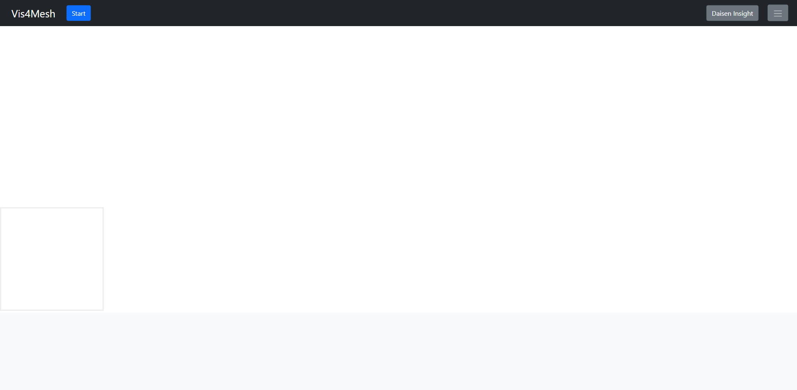
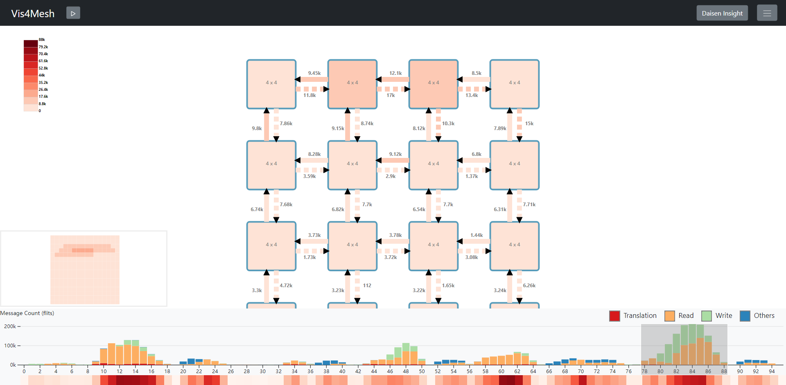
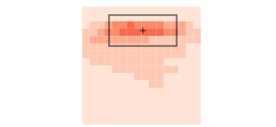
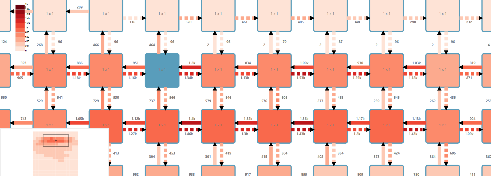
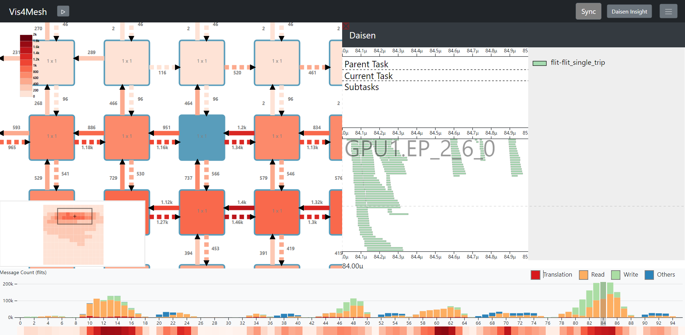

# User Guide

Still working in progress.

## Introduction

Vis4Mesh is a front-end tool and easy-to-use with just a browser. Note that you should have a local benchmark on your computer for Vis4Mesh to load.

The released webpage to launch Vis4Mesh is [https://ueqri.github.io/vis4mesh-release/](https://ueqri.github.io/vis4mesh-release/). You may also clone this repo and deploy a server yourself.

## Start with Vis4Mesh

Vis4Mesh allows for frontend-only interaction and rendering, we can simply start a journey from uploading a benchmark folder in browser.

### Booting

Prepare a benchmark folder for Vis4Mesh and simply upload it through the `Start` button. And Vis4Mesh will load the data and start rendering.

### Profile

This whole window can be divided into 3 parts.

1. **Time Panel**

Time panel is at the bottom of the window, serving for time range controlling. Select a time range in the panel and Vis4Mesh will render and display the traffic of network-on-chip during the specified period.

Time panel roughly describes the total traffic in each time slice. There are 4 types of messages in total and each is displayed in one color. Besides, from the bottom color bar we can tell the conjestion degree of each time slice, which is helpful to find out the bottleneck in terms of time period.

2. **Panorama**

Panorama is on the left top of time panel. It provides an overview of the whole mesh and is colored according to spacial information. The panorama reveals the hotspots of the mesh and helps us to locate them to do further research.

3. **Mesh**

The Mesh takes most part of the window. It shows in detail how data transfers in the mesh and what the conjestion is like. From the mesh we can somehow analyze the memory access pattern, figure out the problem and try to resolve it in the architecture.

## More Powerful with Daisen

Vis4Mesh is powerful enough for mesh network. However when it comes to the architecture, we still want to have insights at a finer level. For this reason, Daisen is integrated into Vis4Mesh.

Daisen could help us look into each component and each message. More details of Daisen is in [https://gitlab.com/akita/vis](https://gitlab.com/akita/vis). And [Daisen Integrated in Vis4Mesh](https://gitlab.com/wsyy0619/vis) is a version for Vis4Mesh integration.

To use Daisen, we should first select a `1 x 1` node and press button `Daisen Insight`. Then Daisen will be on the right panel. With `Sync` button on, Vis4Mesh and Daisen are moving together and help us to focus on the right point.

## Suggested Workflow

1. Find the bottleneck in time slices and specify the time range in `Time Panel`
2. Read `Panorama` and locate hotspots
3. Zoom in to see more details in `Mesh`
4. Select a certain node and launch `Daisen` to research at architecture level

